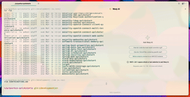
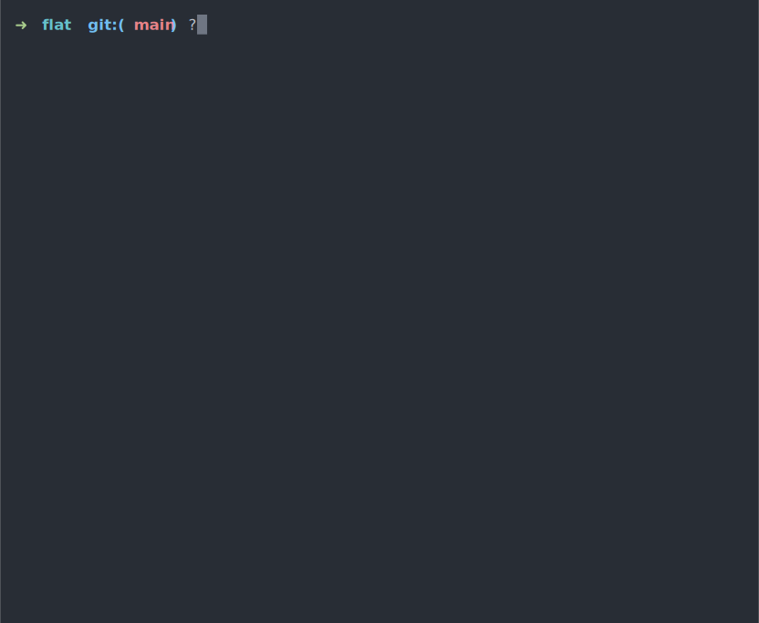
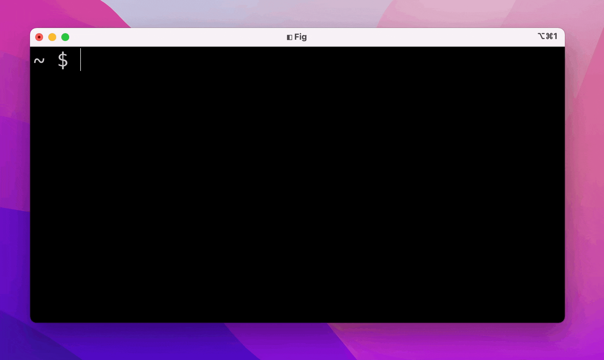

# GPT CLI enabled tools

## [warp](https://www.warp.dev/)

> Warp is a desktop app that enables you to create software by writing plain English. It's powered by OpenAI's GPT-3.

## [copilot-cli](https://githubnext.com/projects/copilot-cli/)

> Copilot CLI is a command line tool that generates code snippets using OpenAI's Codex. It is a wrapper around the
> OpenAI Codex API.

## [Fig AI](https://fig.io/)

> Fig is a desktop app that supercharges your terminal with autocomplete, syntax highlighting, and code snippets. Uses
> OpenAI's Codex.

