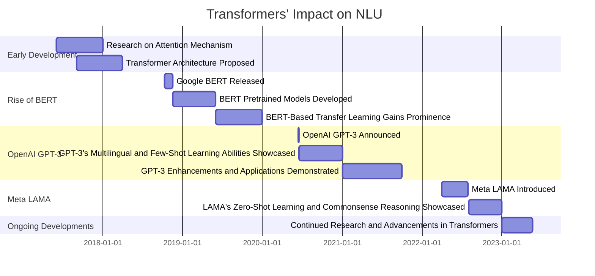

# Transformers: A Game-Changer for Natural Language Understanding (NLU)

## Introduction
Transformers have revolutionized Natural Language Understanding (NLU) in the field of Natural Language Processing (NLP). They have significantly improved the performance of various NLP tasks, including machine translation, sentiment analysis, question answering, text generation, and more.

This README provides a summary of the key milestones in the development of Transformers and their impact on NLU.

## Timeline

## Key Models and Frameworks

1. **Attention Mechanism (2017):** The attention mechanism, proposed in 2017, laid the foundation for Transformers. It enables the model to focus on different parts of the input sequence during processing, allowing for better contextual understanding.

2. **Transformer Architecture (2017):** In 2017, the Transformer architecture was introduced, which replaced recurrent neural networks (RNNs) with attention mechanisms. Transformers leverage self-attention to capture global dependencies and process input sequences in parallel, resulting in improved NLU performance.

3. **Google BERT (2018):** BERT (Bidirectional Encoder Representations from Transformers), released in 2018, is a pretraining framework that utilizes Transformers for unsupervised learning. It demonstrated significant advancements in various NLP tasks by learning contextual word representations.

4. **OpenAI GPT-3 (2020):** GPT-3 (Generative Pre-trained Transformer 3), announced in 2020, is a state-of-the-art language model. It excels at generating human-like text, translating languages, answering questions, and more. GPT-3 showcases the power of large-scale pretrained Transformers for NLU tasks.

These key models and frameworks have played a pivotal role in advancing Natural Language Understanding (NLU) and have demonstrated the transformative impact of Transformers in the field of Natural Language Processing (NLP).

## Conclusion
Transformers, with their attention mechanisms and parallel processing capabilities, have transformed NLU in NLP. Models like Google BERT and OpenAI GPT-3 have demonstrated the impact and potential of Transformers in advancing the state of the art in NLU. Ongoing developments in Transformers continue to push the boundaries of NLP research and applications.

For more detailed information, refer to the respective research papers and documentation of the mentioned models and frameworks.
