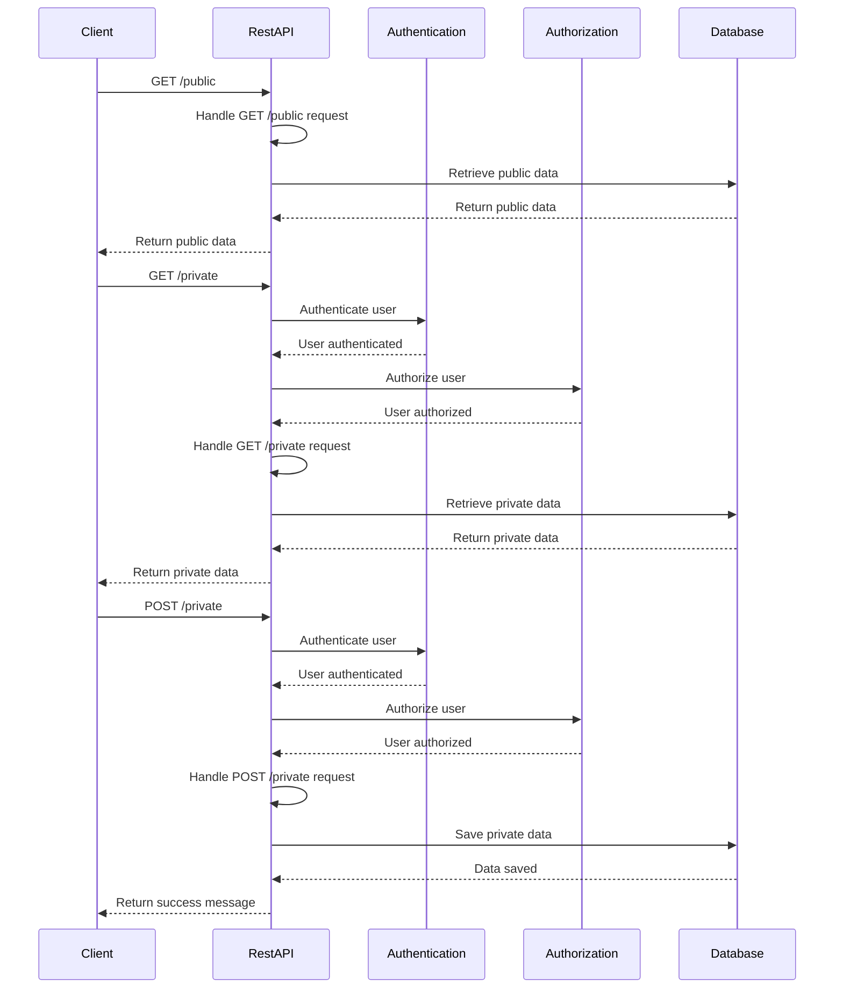

#Result

```mermaid
sequenceDiagram
    participant Client
    participant RestAPI
    participant Authentication
    participant Authorization
    participant Database

    Client->>RestAPI: GET /public
    RestAPI->>RestAPI: Handle GET /public request
    RestAPI->>Database: Retrieve public data
    Database-->>RestAPI: Return public data
    RestAPI-->>Client: Return public data

    Client->>RestAPI: GET /private
    RestAPI->>Authentication: Authenticate user
    Authentication-->>RestAPI: User authenticated
    RestAPI->>Authorization: Authorize user
    Authorization-->>RestAPI: User authorized
    RestAPI->>RestAPI: Handle GET /private request
    RestAPI->>Database: Retrieve private data
    Database-->>RestAPI: Return private data
    RestAPI-->>Client: Return private data

    Client->>RestAPI: POST /private
    RestAPI->>Authentication: Authenticate user
    Authentication-->>RestAPI: User authenticated
    RestAPI->>Authorization: Authorize user
    Authorization-->>RestAPI: User authorized
    RestAPI->>RestAPI: Handle POST /private request
    RestAPI->>Database: Save private data
    Database-->>RestAPI: Data saved
    RestAPI-->>Client: Return success message
```
