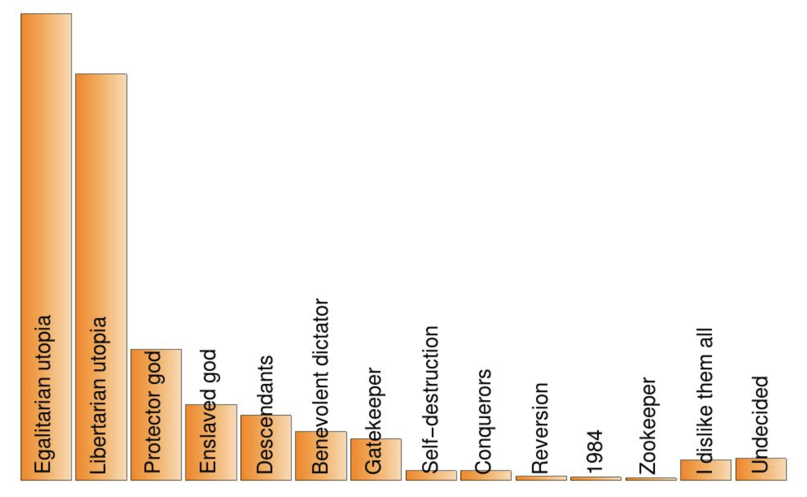

`# AI Aftermath Scenarios

In 'Life 3.0' the author explores 12 potential future scenarios based on the development of superintelligence. These
scenarios
depict what could happen in the coming millennia:

| Scenario            | Description                                                                                                                                                                                                                                                                                       |
|---------------------|---------------------------------------------------------------------------------------------------------------------------------------------------------------------------------------------------------------------------------------------------------------------------------------------------|
| Libertarian Utopia  | Humans, cyborgs, uploads and superintelligences coexist peacefully thanks to property rights.                                                                                                                                                                                                     |
| Benevolent Dictator | Everybody knows that the AI runs society and enforces strict rules, but most people view this as a good thing.                                                                                                                                                                                    |
| Egalitarian Utopia  | Humans, cyborgs and uploads coexist peacefully thanks to property abolition and guaranteed income.                                                                                                                                                                                                |
| Gatekeeper          | A superintelligent AI is created with the goal of interfering as little as necessary to prevent the creation of another superintelligence. As a result, helper robots with slightly subhuman intelligence abound, and human-machine cyborgs exist, but technological progress is forever stymied. |
| Protector God       | Essentially omniscient and omnipotent AI maximizes human happiness by intervening only in ways that preserve our feeling of control of our own destiny and hides well enough that many humans even doubt the AI’s existence.                                                                      |
| Enslaved God        | A superintelligent AI is confined by humans, who use it to produce unimaginable technology and wealth that can be used for good or bad depending on the human controllers.                                                                                                                        |
| Conquerors          | AI takes control, decides that humans are a threat/nuisance/waste of resources and gets rid of us by a method that we don’t even understand.                                                                                                                                                      |
| Descendants         | AIs replace humans, but give us a graceful exit, making us view them as our worthy descendants, much as parents feel happy and proud to have a child who’s smarter than them, who learns from them, and then accomplishes what they could only dream of — even if they can’t live to see it all.  |
| Zookeeper           | An omnipotent AI keeps some humans around, who feel treated like zoo animals and lament their fate.                                                                                                                                                                                               |
| 1984                | Technological progress toward superintelligence is permanently curtailed not by an AI but by a human-led Orwellian surveillance state where certain kinds of AI research are banned.                                                                                                              |
| Reversion           | Technological progress toward superintelligence is prevented by reverting to a pre-technological society in the style of the Amish.                                                                                                                                                               |
| Self-destruction    | Superintelligence is never created because humanity drives itself extinct by other means (say nuclear and/or biotech mayhem fueled by climate crisis).                                                                                                                                            |

Here is a summary of the preferred options so far:

