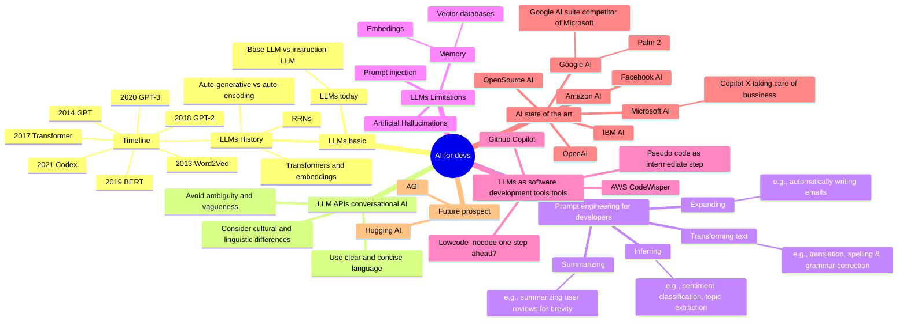

# Jupyter code notebooks of "ChatGPT Prompt Engineering for Developers" by DeepLearning.AI and OpenAI

## What this repository contains

In [ChatGPT Prompt Engineering for Developers](https://www.deeplearning.ai/short-courses/chatgpt-prompt-engineering-for-developers/),
you will learn how to use a large language model (LLM) to quickly build new and powerful applications. Using the OpenAI
API, you’ll be able to quickly build capabilities that learn to innovate and create value in ways that were
cost-prohibitive, highly technical, or simply impossible before now.

This short course taught by Isa Fulford (OpenAI) and Andrew Ng (DeepLearning.AI) will describe how LLMs work, provide
best practices for prompt engineering, and show how LLM APIs can be used in applications for a variety of tasks,
including:

- Summarizing (e.g., summarizing user reviews for brevity)
- Inferring (e.g., sentiment classification, topic extraction)
- Transforming text (e.g., translation, spelling & grammar correction)
- Expanding (e.g., automatically writing emails)

In addition, you’ll learn two key principles for writing effective prompts, how to systematically engineer good prompts,
and also learn to build a custom chatbot.

All concepts are illustrated with numerous examples, which you can play with directly in our Jupyter notebook
environment to get hands-on experience with prompt engineering.

