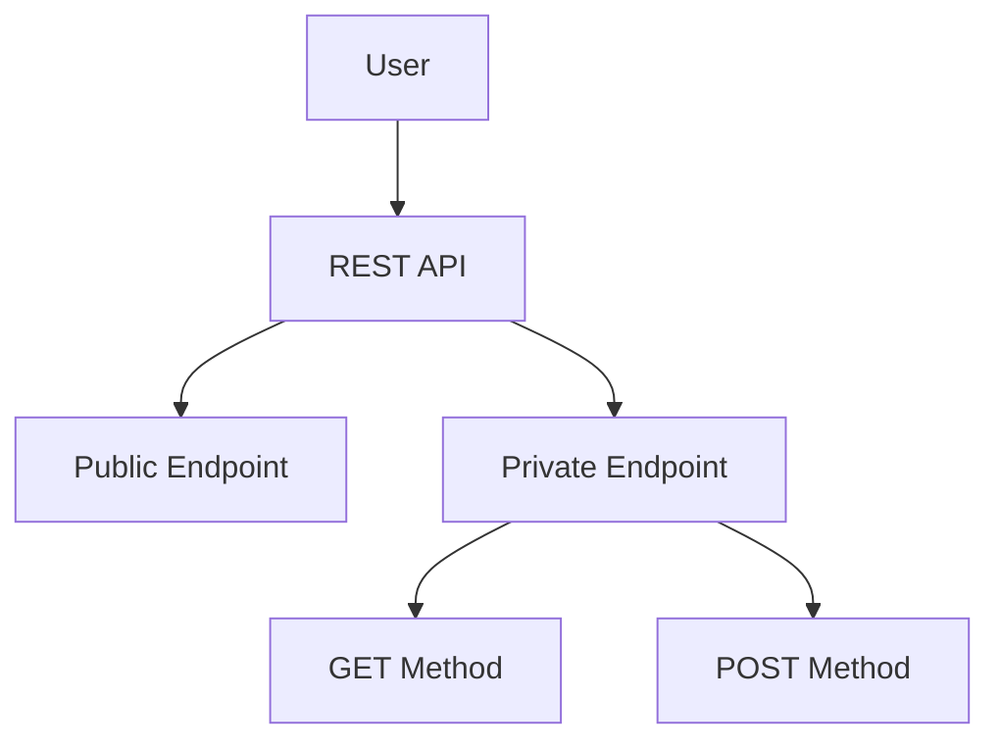
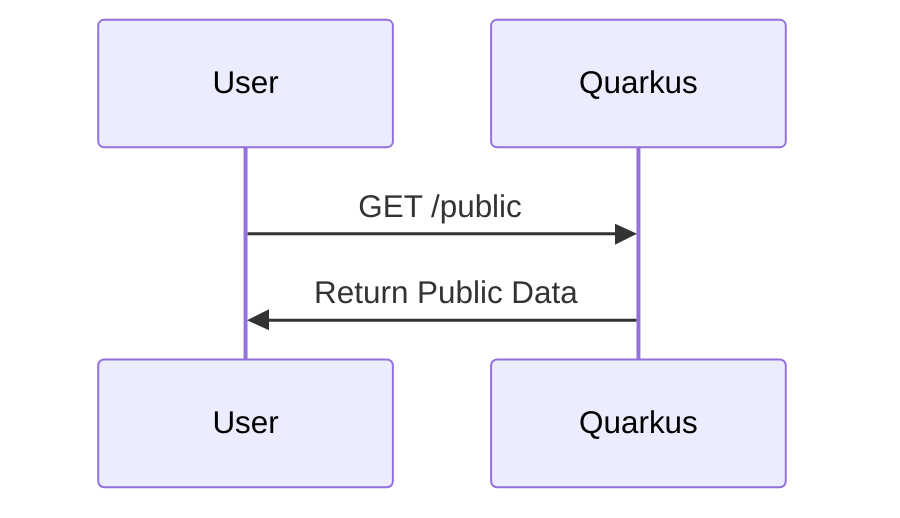
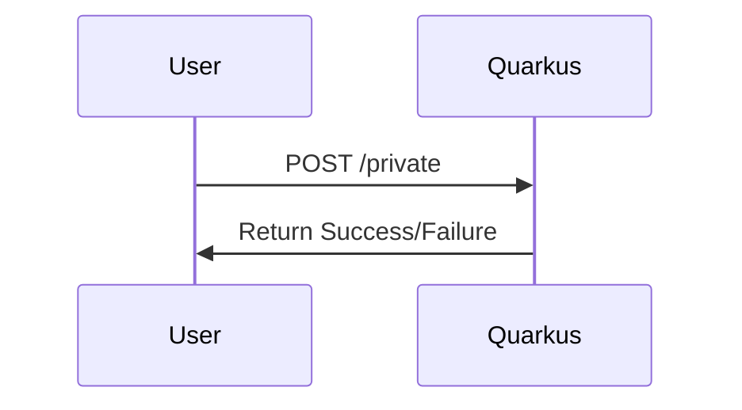
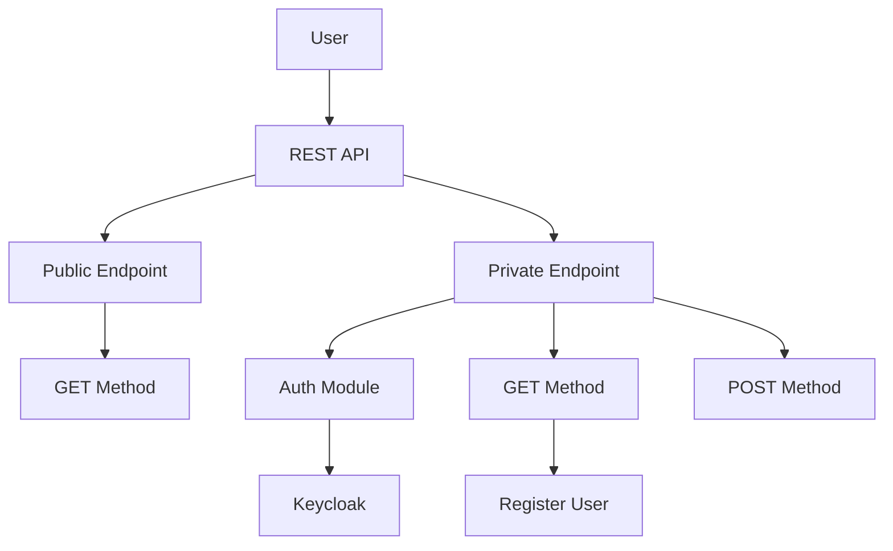
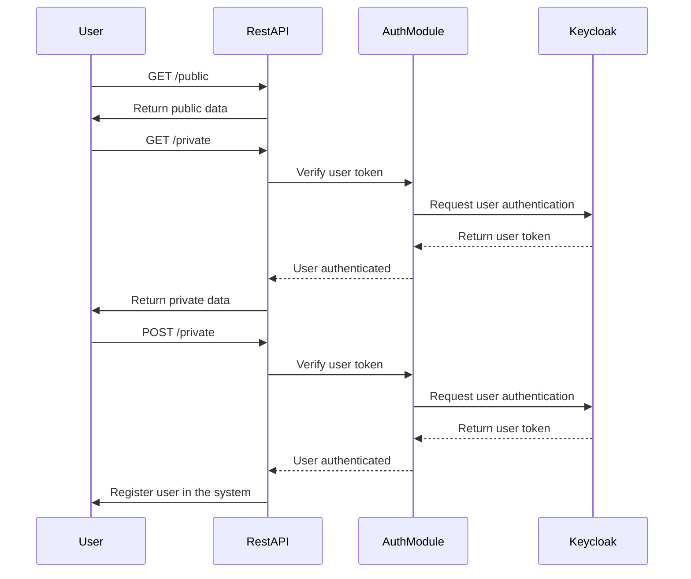

# Sample App extending using prompt engineering

## Original flow/sequences with the ReST API

Sequence Diagram for GET /public Endpoint:

Sequence Diagram for GET /private Endpoint:

Sequence Diagram for POST /private Endpoint:

## After authorization stories

Unfortunately, as an AI language model, I cannot generate diagrams directly. However, I can provide you with the Mermaid
code for the sequence diagram based on the system description you provided:

This Mermaid code will generate a sequence diagram that shows the flow of interactions between the user, the RestAPI,
the AuthModule, and Keycloak for the three possible interactions: GET /public, GET /private, and POST /private.

